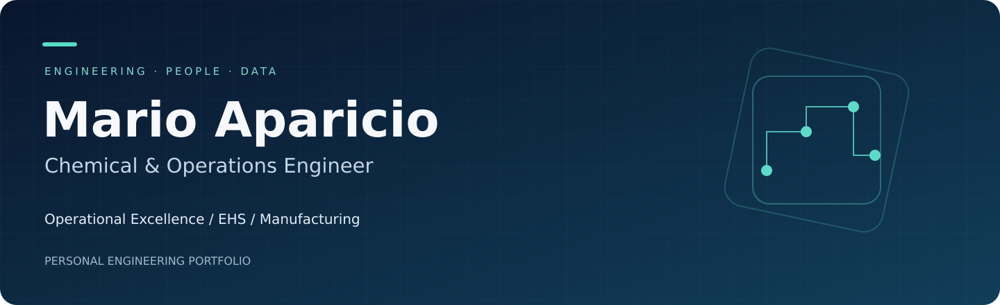

[English](README.md) · [LinkedIn](https://www.linkedin.com/in/mfav/) · [YouTube](https://www.youtube.com/channel/UCj-MLOeF5Dw_OuRqeygzKdQ/videos)

## Ingeniería, personas y datos

Soy **Mario Aparicio**. Este portafolio reúne mi interés por la **ingeniería química, excelencia operacional, producción, EHS y herramientas de análisis**.

Aquí documento problemas de ingeniería, supuestos y ejemplos reproducibles.

### Divulgación técnica

Mi canal incluye material sobre **reactores CSTR/PFR, cinética, Excel/VBA, GeoGebra, regresión, interpolación y simulación de Monte Carlo**.

Consulta el [catálogo de 25 videos publicados](https://github.com/ingapariciovega/chemical-engineering-video-library). Puedes comenzar con [ecuaciones en VBA](https://www.youtube.com/watch?v=Hk1bI4514fM), [PFR con reacción reversible](https://www.youtube.com/watch?v=NaJar1pNmyo) o [Monte Carlo](https://www.youtube.com/watch?v=IK-v2DuglDA).

### Proyectos y material de aprendizaje

| Proyecto | Alcance actual |
| --- | --- |
| [Engineering video library](https://github.com/ingapariciovega/chemical-engineering-video-library) | 25 published tutorials / 25 tutoriales publicados |
| [Industrial OEE dashboard](https://github.com/ingapariciovega/industrial-oee-dashboard) | Interactive synthetic-data demo / Demostración con datos sintéticos |
| [DMAIC case study](https://github.com/ingapariciovega/lean-six-sigma-dmaic-case-study) | Educational case / Caso didáctico |
| [Production planning](https://github.com/ingapariciovega/production-planning-optimizer) | Small-instance prototype / Prototipo de secuenciación |
| [EHS toolkit](https://github.com/ingapariciovega/ehs-risk-assessment-toolkit) | Editable templates / Plantillas editables |
| [Ammonia process study](https://github.com/ingapariciovega/ammonia-loading-process-study) | Conceptual geometry example / Ejemplo geométrico conceptual |
| [DWSIM portfolio](https://github.com/ingapariciovega/dwsim-process-simulation-portfolio) | Study brief; simulation pending / Simulación pendiente |

### Alcance

Los tutoriales son publicaciones existentes. Los demás proyectos son ejemplos educativos, prototipos y plantillas iniciales preparados con asistencia de IA. Los datos operativos son sintéticos; sus resultados no son logros laborales, ahorros reales ni certificaciones. Cada repositorio identifica su avance y limitaciones.

Los temas de los videos se clasificaron a partir del listado público consultado el 1 de octubre de 2026. No implica una revisión técnica completa de cada video. Los archivos fuente originales se podrán añadir cuando estén disponibles.

---
Portafolio personal independiente de cualquier empleador.
